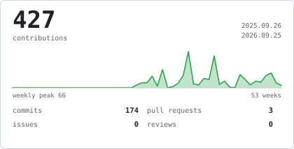
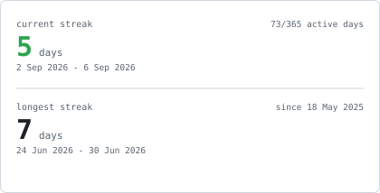
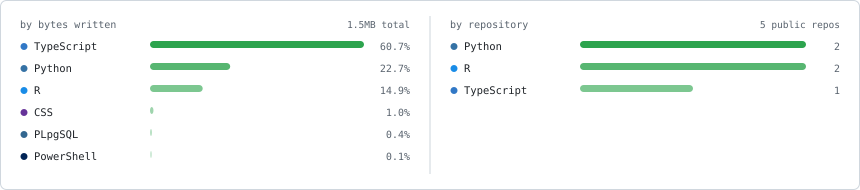
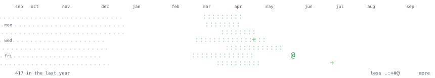

<picture>
  <source media="(prefers-color-scheme: dark)" srcset="portrait-dark.svg">
  
</picture>

<picture><source media="(prefers-color-scheme: dark)" srcset="hd-whoami-dark.svg"></picture>

> 你好，我叫谢依森。 
> I like making stuff.

Empirical economics and finance 

<picture><source media="(prefers-color-scheme: dark)" srcset="hd-research-dark.svg"></picture>

**Present**

[Replicating *Income and Democracy*](https://github.com/opxie1/income-and-democracy-replication) 
<samp>UChicago &middot; Acemoglu, Johnson, Robinson and Yared</samp>

[Negative Effects of Quantitative Easing](https://github.com/opxie1/usd) 
<samp>University of South Dakota</samp>

<samp>and a few other things that i can't disclose right now</samp>

**Past**

[Replicating *Explaining the Decline in the US Employment-to-Population Ratio*](https://github.com/opxie1/abraham-kearney-2020-replication) 
<samp>UChicago &middot; Abraham and Kearney, 2020</samp>

[ICE detention and encounters, facility-to-county crosswalks](https://github.com/opxie1/icedetention) 
<samp>UC Merced &middot; aggregation pipeline</samp>

[Credit and equity market reactions to the April 2025 announcement](https://docs.google.com/spreadsheets/d/1X-JbS7r9XyflgLVskf3_-pdXnY9qZfwM/edit?gid=477933987#gid=477933987) 
<samp>Delaware State University &middot; event study</samp>

[Neighbors &rarr; Savers](https://github.com/opxie1/respondify) 
<samp>Respondify</samp>

<picture><source media="(prefers-color-scheme: dark)" srcset="hd-activity-dark.svg"></picture>

<picture><source media="(prefers-color-scheme: dark)" srcset="stats-dark.svg"></picture> <picture><source media="(prefers-color-scheme: dark)" srcset="streak-dark.svg"></picture>

<picture><source media="(prefers-color-scheme: dark)" srcset="langs-dark.svg"></picture>

<picture><source media="(prefers-color-scheme: dark)" srcset="year-dark.svg"></picture>

<picture><source media="(prefers-color-scheme: dark)" srcset="hd-stack-dark.svg"></picture>

<samp>python &middot; r &middot; stata &middot; sql &middot; latex &middot; git</samp>

<picture><source media="(prefers-color-scheme: dark)" srcset="hd-elsewhere-dark.svg"></picture>

<samp>ethanxie@udel.edu</samp>
